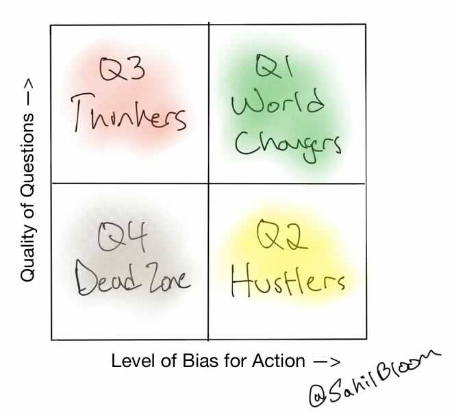
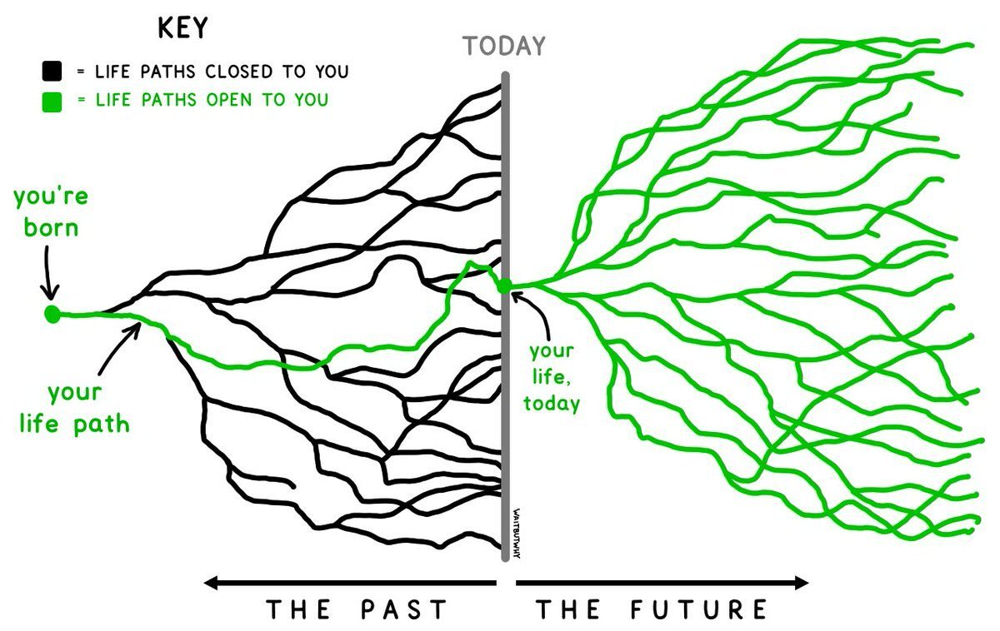

Sahil Bloom ([@SahilBloom](https://twitter.com/SahilBloom))

The top 1% of new ideas I've encountered:

[Tweet link](https://twitter.com/SahilBloom/status/1530548115891175424)

---

Sahil Bloom ([@SahilBloom](https://twitter.com/SahilBloom))

Question-Action Matrix

The most intelligent people don't have the best answers—they ask the best questions.

Asking great questions is how you uncover the truth.

Bias for action is how you build.

The Question-Action Matrix is a 2x2 of quality of questions and bias for action. [pic.twitter.com/8yA5s30ZTx](https://twitter.com/SahilBloom/status/1530548120152596482/photo/1)

[Tweet link](https://twitter.com/SahilBloom/status/1530548120152596482)

---

Sahil Bloom ([@SahilBloom](https://twitter.com/SahilBloom))

You can effectively place people in one of the four quadrants:

Q1: World-changers (rare!)

Q2: Grinders/hustlers

Q3: Philosophers/thinkers

Q4: Dead zone

Invest heavily behind the Q1s, hire more of the Q2s, spend time with the Q3s, and avoid Q4s. [pic.twitter.com/3gV6YqOict](https://twitter.com/SahilBloom/status/1530548123835277312/photo/1)

[Tweet link](https://twitter.com/SahilBloom/status/1530548123835277312)

---

Sahil Bloom ([@SahilBloom](https://twitter.com/SahilBloom))

The Idea Maze

The best startup ideas have contemplated the many possible future paths based on how the world shifts.

This is the "idea maze”—it is a dynamic map of the future.

Founders with a deep understanding of their maze are more likely to win.

(h/t [@balajis](https://twitter.com/balajis) [@cdixon](https://twitter.com/cdixon))

[Tweet link](https://twitter.com/SahilBloom/status/1530548125164781570)

---

Sahil Bloom ([@SahilBloom](https://twitter.com/SahilBloom))

Page 2 Learning

Page 1 is the first page on Google or the front page of the newspaper.

Page 1 is what's readily available to the masses.

But everyone reads Page 1—so there’s no alpha there.

To find asymmetric opportunities, you have to go deeper—to Page 2 and beyond.

[Tweet link](https://twitter.com/SahilBloom/status/1530548126091726848)

---

Sahil Bloom ([@SahilBloom](https://twitter.com/SahilBloom))

Progressive Focus Overload

Progressive overload training is when you gradually increase the weight, frequency, or reps in your workout routine.

You slowly increase the load on your system to force it to get stronger.

I think the same concept can be applied to your focus...

[Tweet link](https://twitter.com/SahilBloom/status/1530548127459155968)

---

Sahil Bloom ([@SahilBloom](https://twitter.com/SahilBloom))

Most of us start with a very low base capacity for deep focus.

Rather than jump into a focused work habit with failed 90-min sprints, we can slowly build our focus muscle:

• Week 1: 30 min

• Week 2: 35 min

• Week 3: 40 min

• ...

Progressively overload your focus muscle!

[Tweet link](https://twitter.com/SahilBloom/status/1530548128390205441)

---

Sahil Bloom ([@SahilBloom](https://twitter.com/SahilBloom))

Uphill Decisions

When faced with two options, choose the one that’s more difficult in the short-term.

This is called making "uphill decisions”—overriding your biological pain avoidance instinct.

It's worth it—short-term pain creates compounding long-term gain.

(h/t [@naval](https://twitter.com/naval))

[Tweet link](https://twitter.com/SahilBloom/status/1530548129308856320)

---

Sahil Bloom ([@SahilBloom](https://twitter.com/SahilBloom))

Anti-Goals

With traditional goals, we envision the optimal outcome.

Anti-goals are the things we DON'T want to happen.

Anti-goals are about avoiding the "Pyrrhic victory”—a victory that takes such a terrible toll on the victor that it might has well have been a defeat. [twitter.com/SahilBloom/sta…](https://twitter.com/SahilBloom/status/1525466667249180672)

> 
> Sahil Bloom ([@SahilBloom](https://twitter.com/SahilBloom))

> I started establishing “Anti-Goals” for all new projects.

Everything changed.

Here’s how it works:

[Tweet link](https://twitter.com/SahilBloom/status/1525466667249180672)

[Tweet link](https://twitter.com/SahilBloom/status/1530548130571223041)

---

Sahil Bloom ([@SahilBloom](https://twitter.com/SahilBloom))

Local or Tourist

When faced with chaos, ask yourself whether you are a local or a tourist.

Tourists leave when the weather gets bad.

Locals are aware that seasons change, and know how to live with the cycles.

Always seek to play games where you're a local.

(h/t [@ShaanVP](https://twitter.com/ShaanVP))

[Tweet link](https://twitter.com/SahilBloom/status/1530548132370690050)

---

Sahil Bloom ([@SahilBloom](https://twitter.com/SahilBloom))

30-for-30 Plan

If you want to improve at anything, follow this simple approach:

• 30 days

• 30 min per day

30 days of effort is a real commitment, but small enough that you can mentally take it on.

900 minutes of accumulated effort yields surprisingly significant results. [twitter.com/sahilbloom/sta…](https://twitter.com/sahilbloom/status/1517129074178674688)

> 
> Sahil Bloom ([@SahilBloom](https://twitter.com/SahilBloom))

> If I want to improve at anything, I have a fixed approach.

I call it the 30-for-30 plan:

[Tweet link](https://twitter.com/SahilBloom/status/1517129074178674688)

[Tweet link](https://twitter.com/SahilBloom/status/1530548133314412545)

---

Sahil Bloom ([@SahilBloom](https://twitter.com/SahilBloom))

Genius of the "AND"

We often create either/or decisions where we have to choose between one thing or the other.

This is the Tyranny of the "OR"--the false tradeoffs.

The Genius of the "AND" is the realization that we can do both—it's just more difficult.

(h/t Jim Collins)

[Tweet link](https://twitter.com/SahilBloom/status/1530548135398875137)

---

Sahil Bloom ([@SahilBloom](https://twitter.com/SahilBloom))

Barrel Talent

Barrels are the talent in an org who are capable of taking an idea from conception to live.

They are very difficult to find and typically the core constraint on the number of initiatives a company can take on simultaneously.

Find more barrels.

(h/t [@rabois](https://twitter.com/rabois))

[Tweet link](https://twitter.com/SahilBloom/status/1530548136401424385)

---

Sahil Bloom ([@SahilBloom](https://twitter.com/SahilBloom))

The Feynman Technique

To learn anything:

Step 1: Identify a topic

Step 2: Try to explain it to a 5-year-old

Step 3: Study to fill in knowledge gaps

Step 4: Organize, convey, and review

True genius is the ability to simplify, not complicate.

Simple is beautiful.

[Tweet link](https://twitter.com/SahilBloom/status/1530548137579921410)

---

Sahil Bloom ([@SahilBloom](https://twitter.com/SahilBloom))

Intellectual Sparring Partners

Most of us need fewer friends and more intellectual sparring partners.

Friends are easy to come by.

Intellectual sparring partners are harder to find.

They will call you on your BS, question your assumptions, and push you to think deeply.

[Tweet link](https://twitter.com/SahilBloom/status/1530548138540470279)

---

Sahil Bloom ([@SahilBloom](https://twitter.com/SahilBloom))

Paths Open vs. Closed

Black Lines = paths closed

Green Lines = paths open

We spend too much time focusing on what might have been (black) and not enough time focusing on what may be (green).

Never underestimate the density of opportunity that lies ahead.

(h/t [@waitbutwhy](https://twitter.com/waitbutwhy)) [pic.twitter.com/jhFfP6JX98](https://twitter.com/SahilBloom/status/1530548142260768768/photo/1)

[Tweet link](https://twitter.com/SahilBloom/status/1530548142260768768)

---

Sahil Bloom ([@SahilBloom](https://twitter.com/SahilBloom))

"What Am I Sick Of?" Framework

Jerry Seinfeld once said:

”A big part of innovation is saying, 'You know what I'm really sick of?'"

Constantly asking "what am I sick of?" is a great framework for developing new business ideas.

See the world as it is—and how it could be better.

[Tweet link](https://twitter.com/SahilBloom/status/1530548143770812417)

---

Sahil Bloom ([@SahilBloom](https://twitter.com/SahilBloom))

Engineered Serendipity

Some of what we call "luck" is actually the macro result of thousands of micro actions.

Your daily habits can put you in a position where "luck" is more likely to strike.

It's possible to increase your serendipity surface area and engineer your own luck.

[Tweet link](https://twitter.com/SahilBloom/status/1530548145045876744)

---

Sahil Bloom ([@SahilBloom](https://twitter.com/SahilBloom))

Free Time as a Call Option

Hustle culture lied to you—you've incorrectly been told that free time is bad.

The reality: Free time is a call option on future interesting opportunities.

When you have free time, you have the headspace and bandwidth to pursue high-upside ideas.

[Tweet link](https://twitter.com/SahilBloom/status/1530548146035736576)

---

Sahil Bloom ([@SahilBloom](https://twitter.com/SahilBloom))

Q1 Relationships

All relationships exist on a 2x2 matrix of:

(1) How healthy it is

(2) How enjoyable it is

Q1 relationships are healthy &amp; enjoyable.

Focus on spending more energy on your Q1 relationships—cherish them.

Scrub the Q4s from your life.

(h/t [@waitbutwhy](https://twitter.com/waitbutwhy)) [pic.twitter.com/wgwGKCpdb1](https://twitter.com/SahilBloom/status/1530548150557089793/photo/1)

[Tweet link](https://twitter.com/SahilBloom/status/1530548150557089793)

---

Sahil Bloom ([@SahilBloom](https://twitter.com/SahilBloom))

Attention Residue

Attention residue is the spillover of attention from one task into the next.

It inhibits clear focus on the new task by taking up headspace.

By grazing from task to task, we constrain our potential.

Try this: Single task sprints with clear breaks in between.

[Tweet link](https://twitter.com/SahilBloom/status/1530548152436146180)

---

Sahil Bloom ([@SahilBloom](https://twitter.com/SahilBloom))

Yerkes-Dodson Law

The Yerkes-Dodson Law says stress and performance are positively correlated—up to a point, after which more stress reduces performance.

High performers:

• Are self-aware of their curve

• Shift the apex to the right

They play the game more effectively. [pic.twitter.com/7ZCQTo0ypc](https://twitter.com/SahilBloom/status/1530548156215304193/photo/1)

[Tweet link](https://twitter.com/SahilBloom/status/1530548156215304193)
