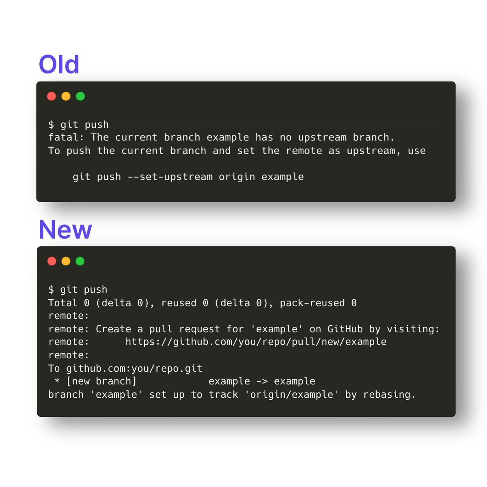

James Ide ([@JI](https://twitter.com/JI))

With the newest version of Git 2.37.0, you can run just "git push" to push new branches. No more "--set-upstream origin". Enable with:

git config --global --add --bool push.autoSetupRemote true [pic.twitter.com/1SzIqzvEFR](https://twitter.com/JI/status/1546948817462800384/photo/1)

[Tweet link](https://twitter.com/JI/status/1546948817462800384)